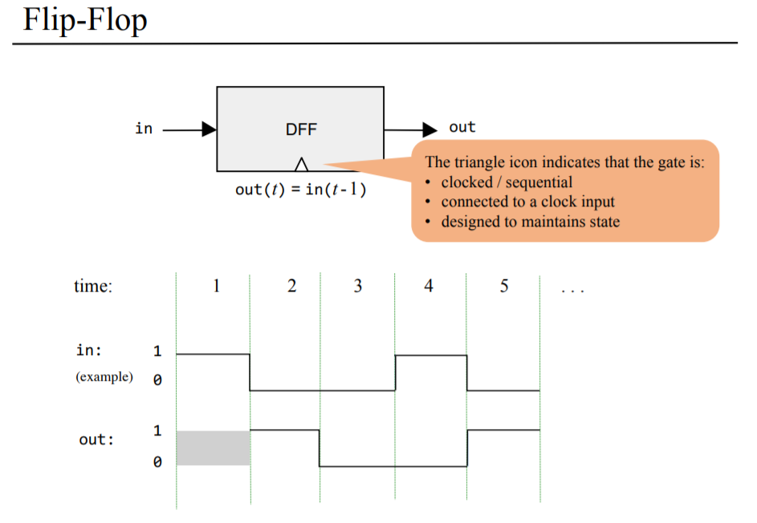

# Building Sequential logic chips!

This time, we have another built-in chip given to us other than Nand, called *data flip-flops (DFF)*.

## DFF
- Basically, it is a gate that can delay the input signal by one time unit.

## Bit
- 1 bit Register

## Register
- 16-bit Register

## RAM8

- `load` is `Demux` by address into 8 ways, and fed into the registers
- `in` is fanned out to every register
- Every `out` of the registers are `Mux`ed into one way.

## RAM64
- It can be constructed using eight RAM8.
- The `address` bus is increased from 3 bits in RAM8 to 6 bits in RAM64.
  -  We can use the upper 3 bits to choose a RAM8 to manipulate, and other lower bits to select the register in this particular RAM8.

## RAM512
- Same principles as stated above.

## RAM4K
- Same principles as stated above.

## RAM16K
- Same principles as stated above.

## PC