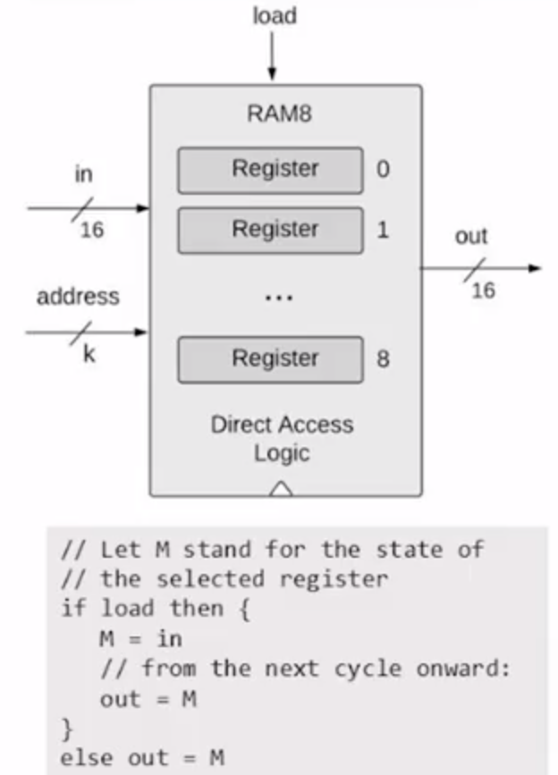

# Building Sequential logic chips!

This time, we have another primitive chip given to me other than Nand, called DFF.

## Bit
- 1 bit Register

## Register
- 16-bit Register

## RAM8

- `load` is `Demux` by address into 8 ways, and fed into the registers
- `in` is fanned out to every register
- Every `out` of the registers are `Mux`ed into one way.

## RAM64

## RAM512

## RAM4K

## RAM16K

## PC