# Machine Language

## Computer System

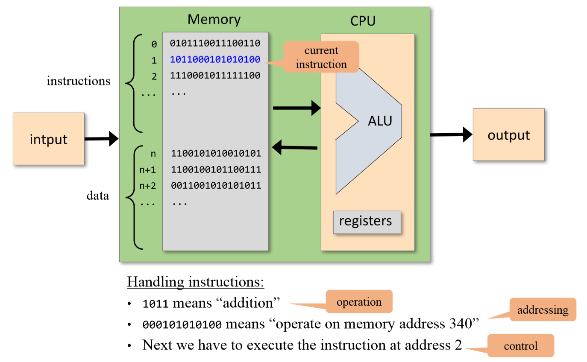

Those binary numbers represent our instructions to the computer. They are called *machine language*.

However, it is hard for us human to read or write those binary numbers. What can we do? Well, we can use symbols to represent those binary numbers.

## Assembly Language

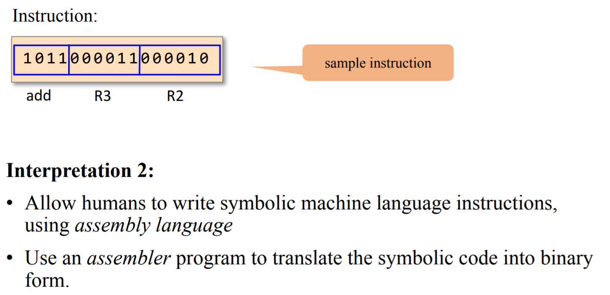

We will actually build an assembler in [Project 6](https://github.com/Yuchen-Wang-SH/Build-a-Computer-From-Logic-Gates-to-Operating-System/tree/master/projects/06)!

## Machine Language
- Usually correspond to the operations that the hardware is designed to support:
  - Arithmetic operations: add, subtract, …
  - Logical operations: and, or, …
  - Flow control: “goto instruction n”
    - “if (condition) then goto instruction n”
- Differences between machine languages:
  - Instruction set richness (division? bulk copy? …)
  - Data types (word width, floating point…).

However, How does the language allow us to specify on which data the instruction should operate? Accessing a memory location is expensive: 
- Need to supply a long address
- Getting the memory contents into the CPU takes time

Our Solution is: Memory Hierarchy:

### Memory Hierarchy

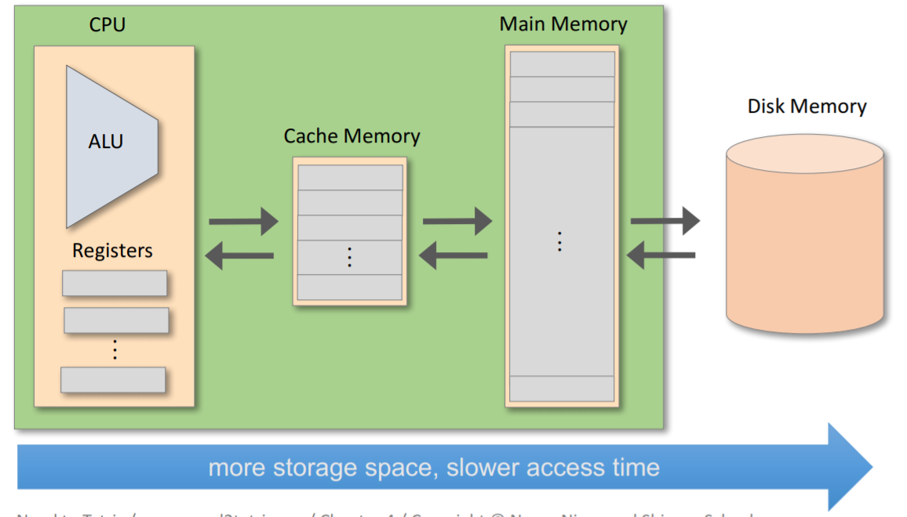

- The CPU typically contains a few, easily accessed, registers
- Their number and functions are a central part of the machine language

### Addressing Modes

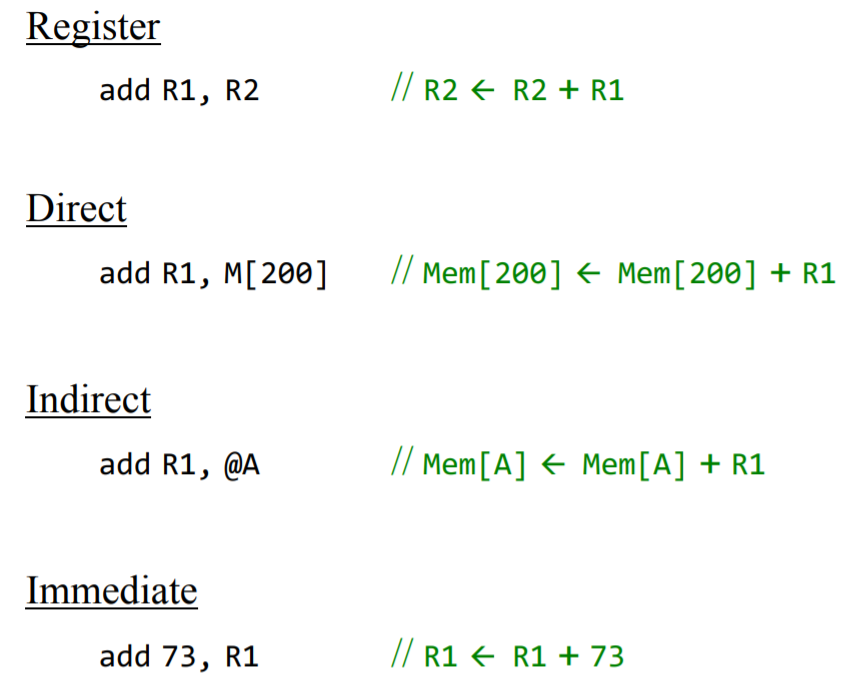

## Hack Computer: The 16-bit Computer We will Build

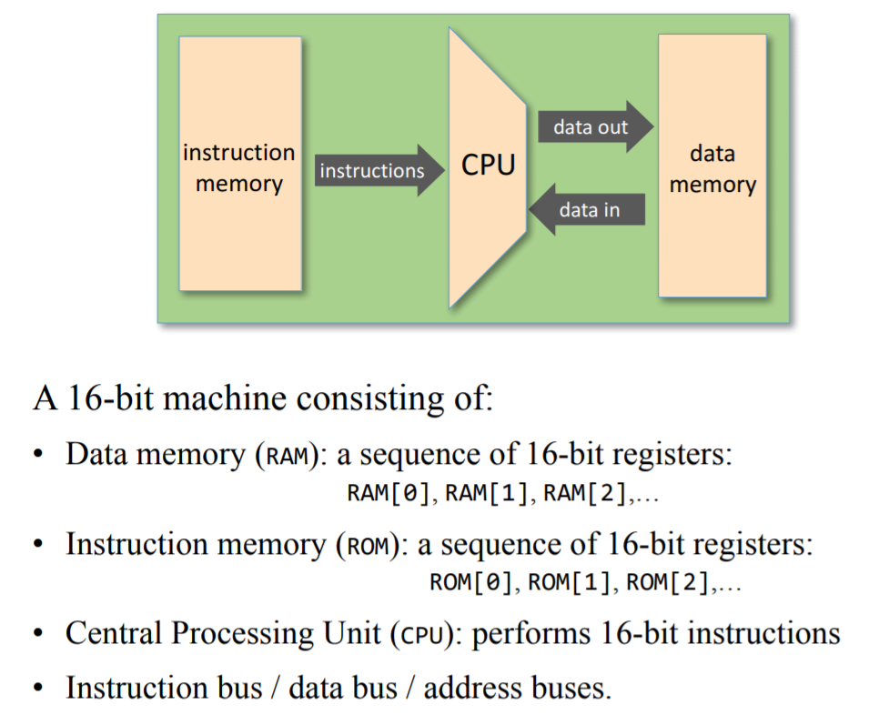

This is the computer we will actually build in [Project 5](https://github.com/Yuchen-Wang-SH/Build-a-Computer-From-Logic-Gates-to-Operating-System/tree/master/projects/05)!

## Hack Machine Language

It consists of:
- 16-bit A-instructions
- 16-bit C-instructions

It recognizes three 16-bit registers:
- D: used to store data
- A: used to store data / address the memory
- M: represents the currently addressed memory register: M = RAM[A]

### A-instruction
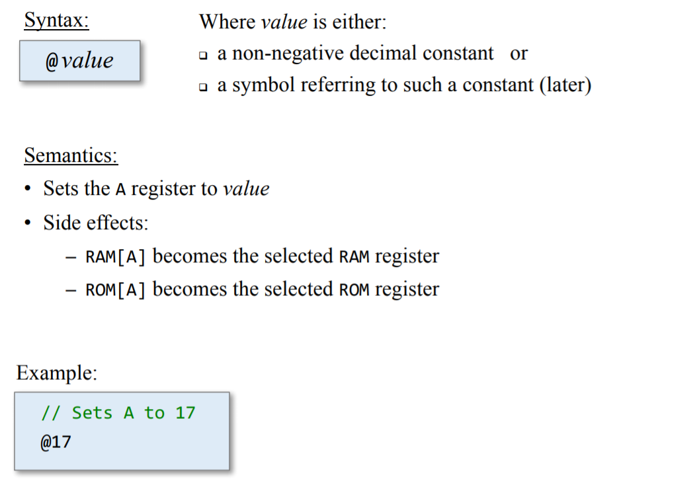
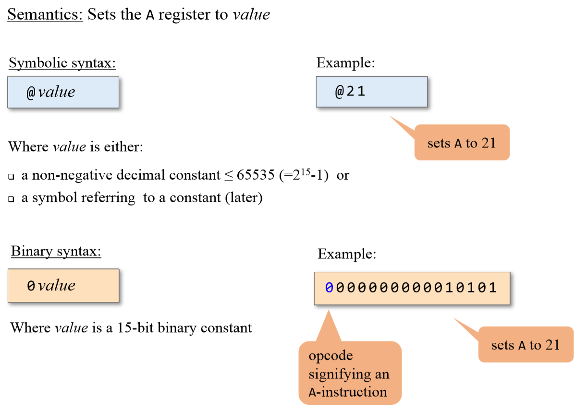

### C-instruction
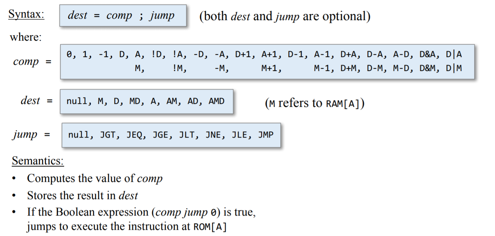
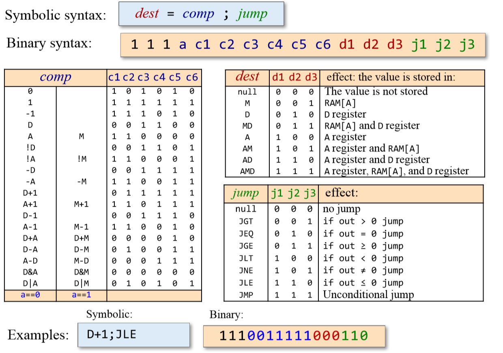

## Input / Output

Now we are going to connect a display unit and a keyboard to our Hack Computer. But how are we going to make them work?

### Display Unit

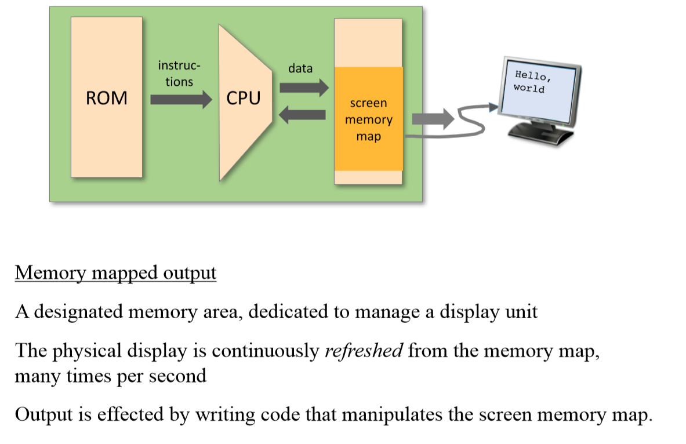
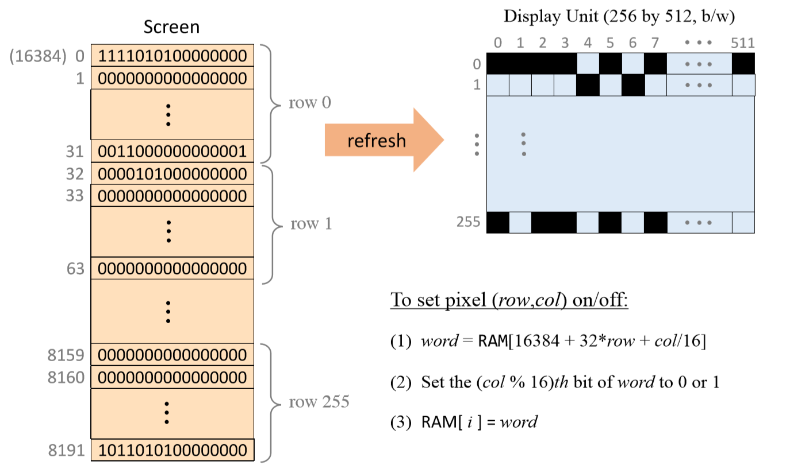

### Keyboard

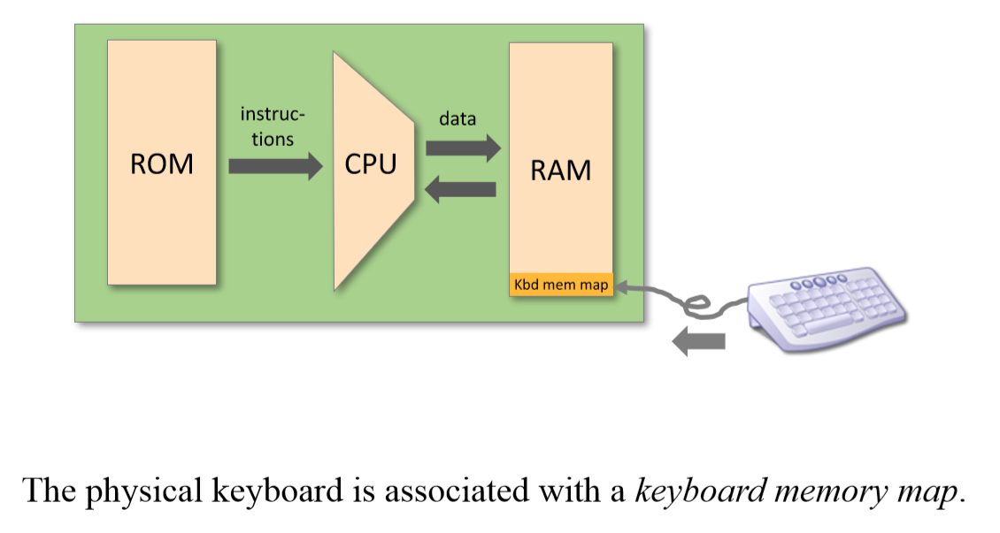
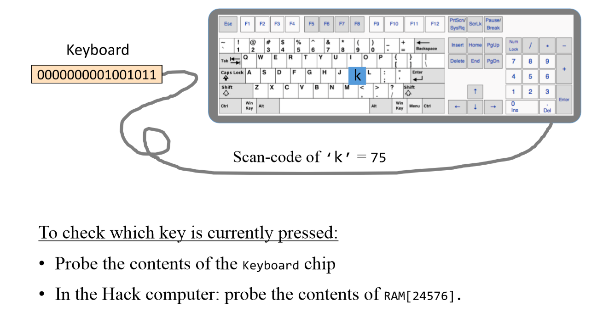
