# Computer Architecture

In this project, I wrote HDL to:
1. implement the CPU
2. implement the Memory (RAM and memory mapping for screen and keyboard)
3. construct the whole 16-bit Hack Computer!

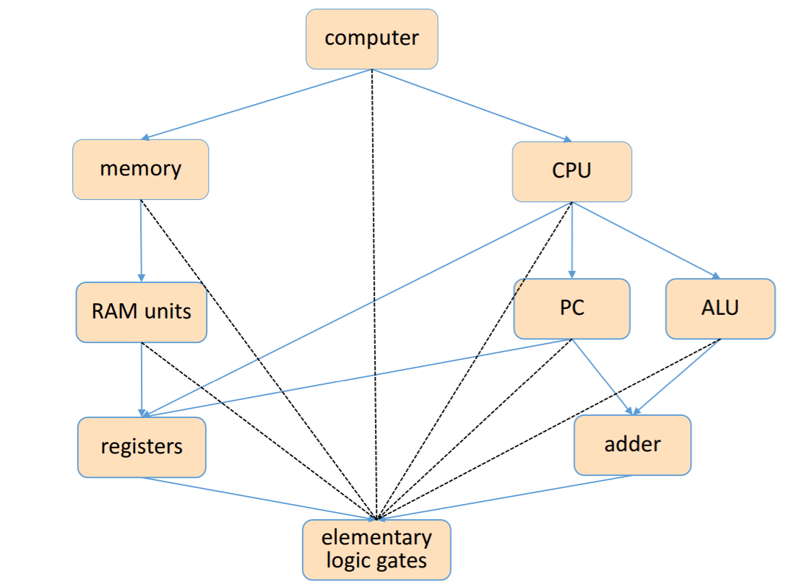

## Basic CPU loop
Repeat:
- Fetch an instruction from the program memory
- Execute the instruction.

### Fetching

### Executing

If the Memory is one address space, this scheme will not work:
- There is a clash because both programs and data are in the same memory
- We can do fetch, then execute. But we have to remember our instruction from the fetch when we are in execute.

The Solutions: 
1. Instruction Register and fetch / execute bit

2. Harvard Architecture

## Hack Computer
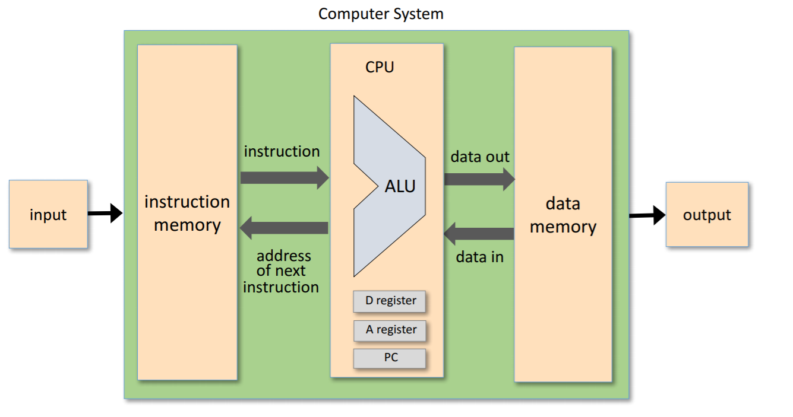
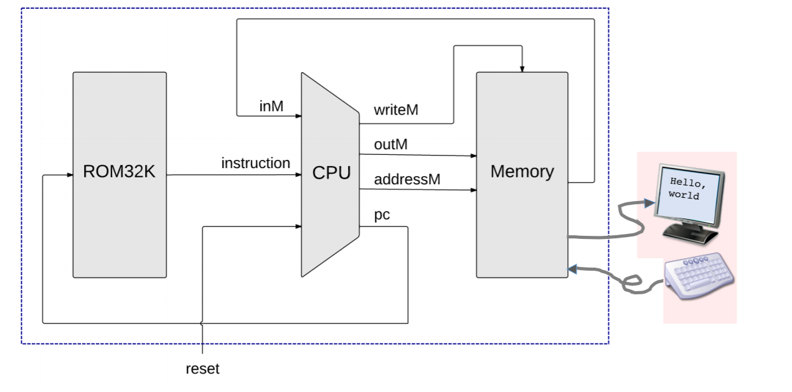

## Hack CPU
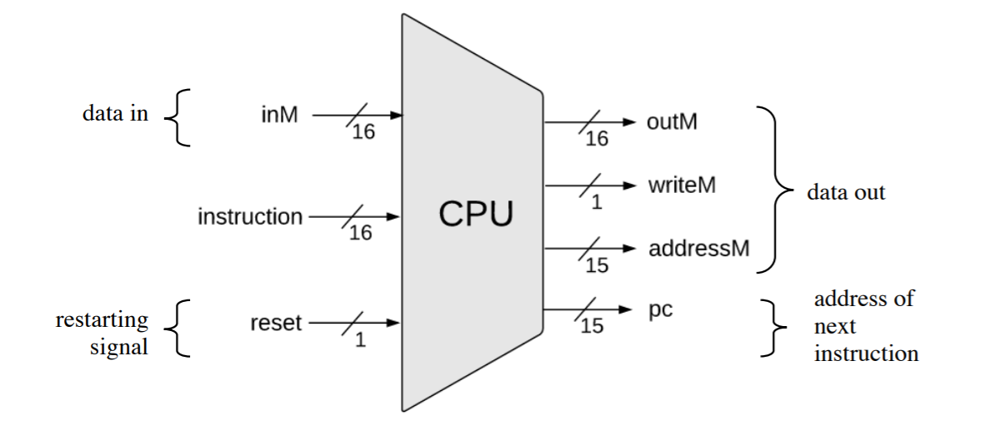
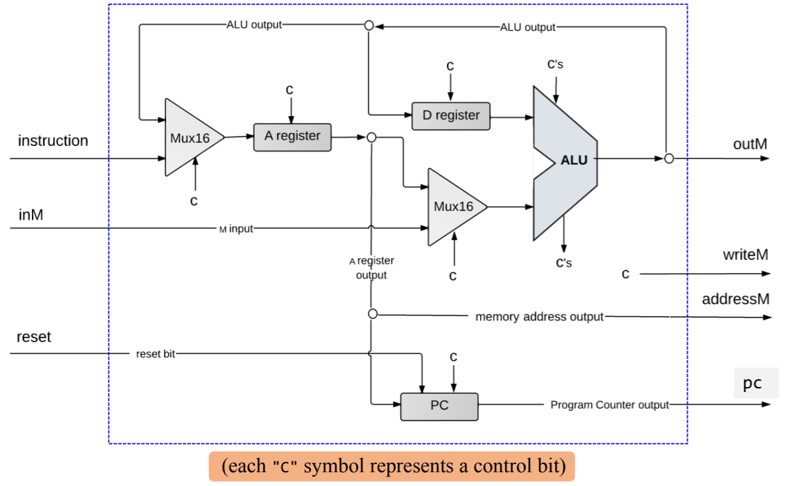

### A-instructions
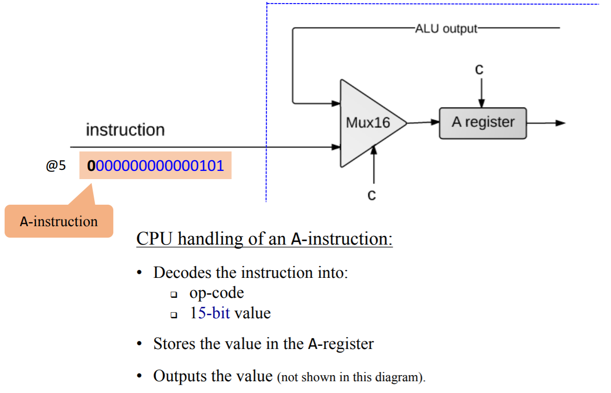
For the C of Mux16:
- If instruction is A, then Mux must output instruction, and C of A must be 1.
- If *d1* = 1, C of A must be 1.
If A-instruction, only A can change. So control bits of D and writeM should AND with instruction[15].

### C-instructions
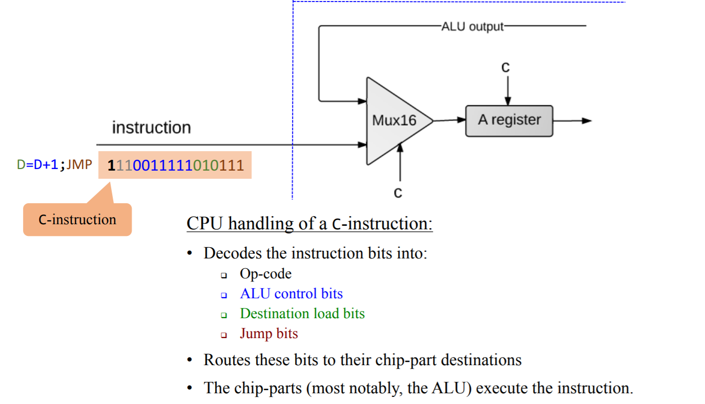
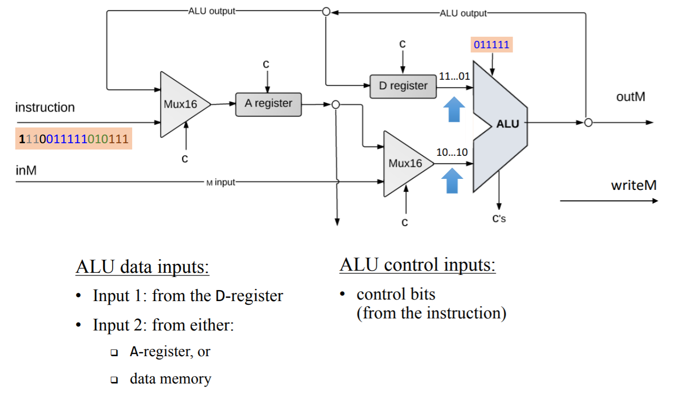
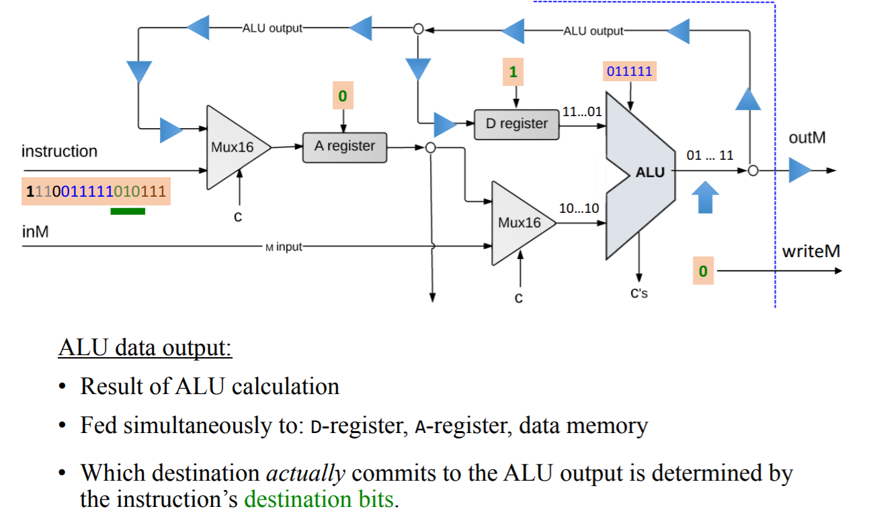
Insights:
1. Comparing to the spec of ALU in Project 2:
   1. x is D;
   2. y is A or M. If *a* in C-instructions is 0, it is A. Else, it is M.
   3. *c1* ~ *c6* are the control bits of ALU.
2. If *d1* is 1, *dest* must include A. *d2* D, *d3* M.
3. You can only jump in C instructions. (use AND)
4. D, M can only be changed in C instructions. (use AND)

### Control
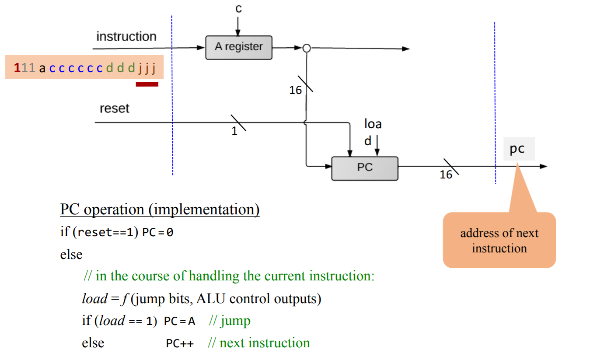

## Hack Memory
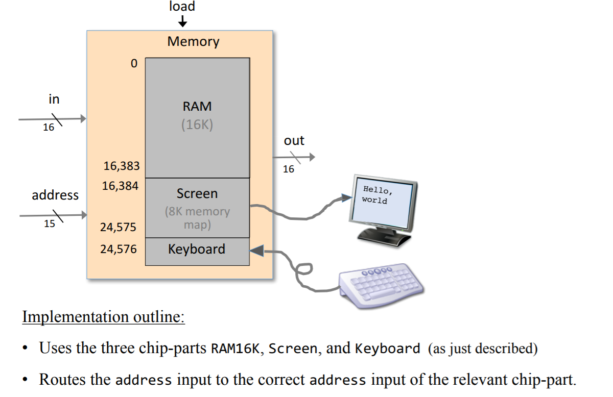
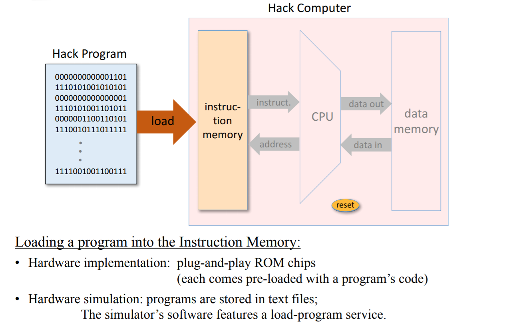