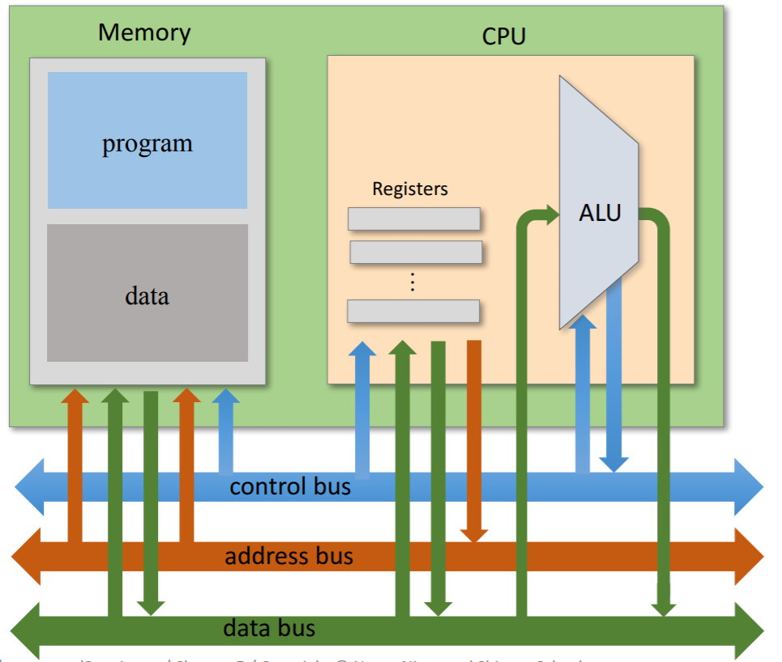
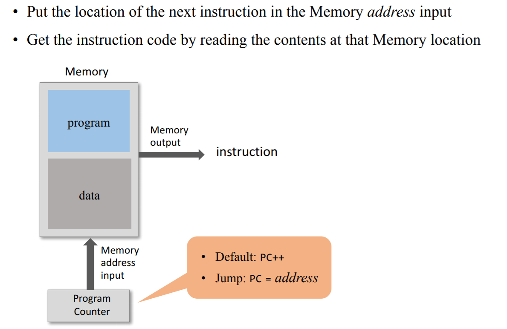
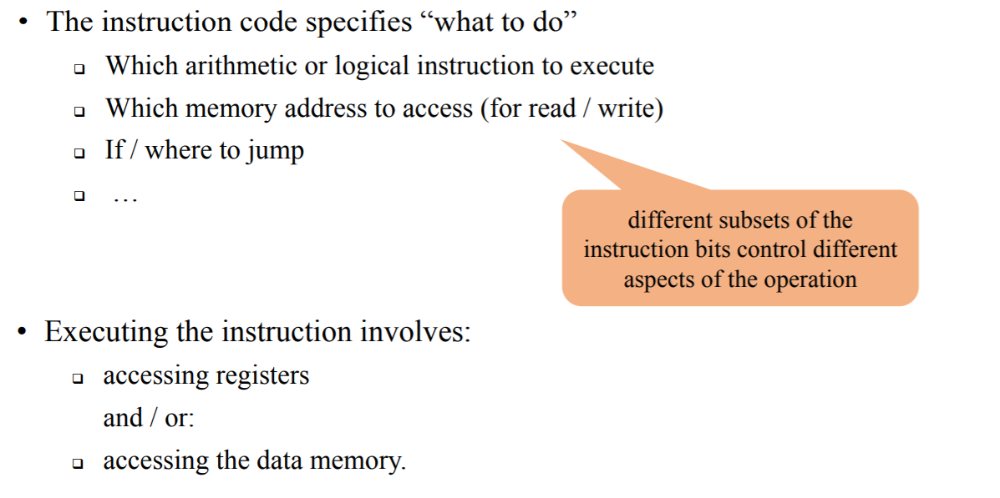
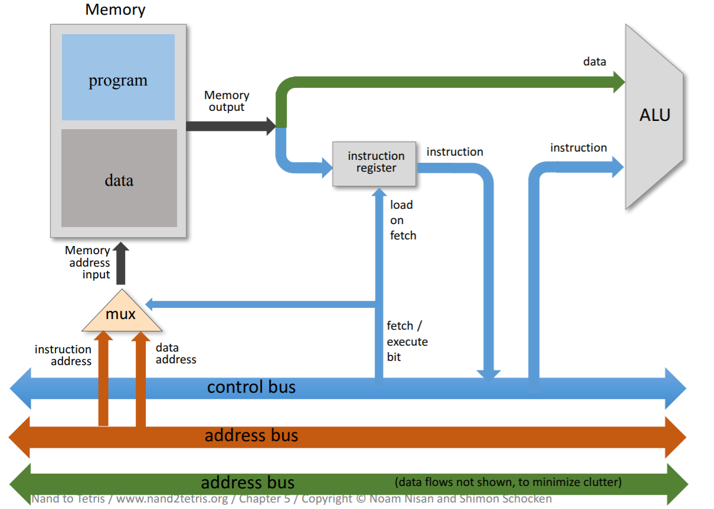
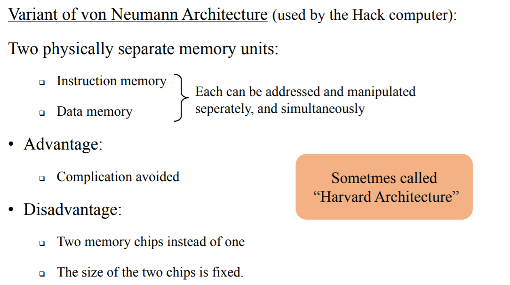

# Computer Architecture

## Basic CPU loop
Repeat:
- Fetch an instruction from the program memory
- Execute the instruction.

### Fetching

### Executing

If the Memory is one address space, this scheme will not work:
- There is a clash because both programs and data are in the same memory
- We can do fetch, then execute. But we have to remember our instruction from the fetch when we are in execute.

The Solutions: 
1. Instruction Register and fetch / execute bit

2. Harvard Architecture
