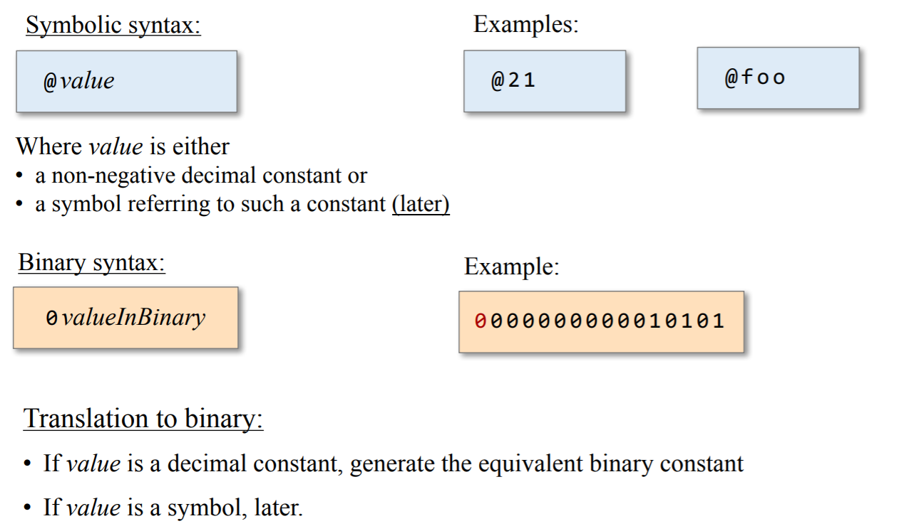
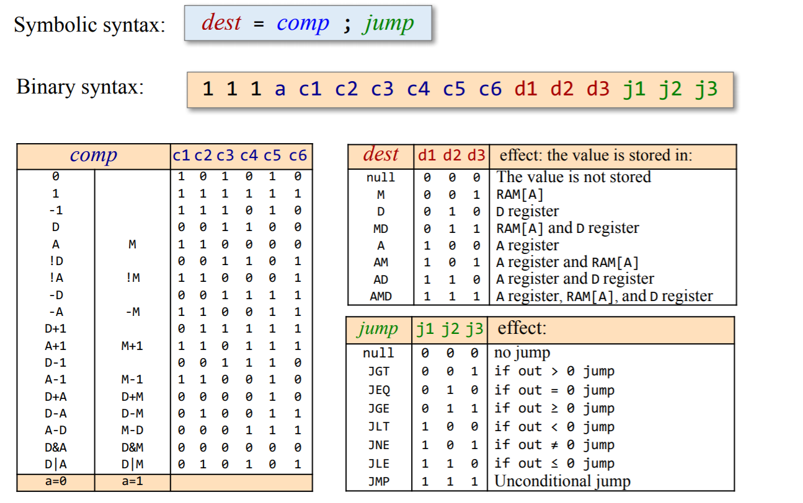
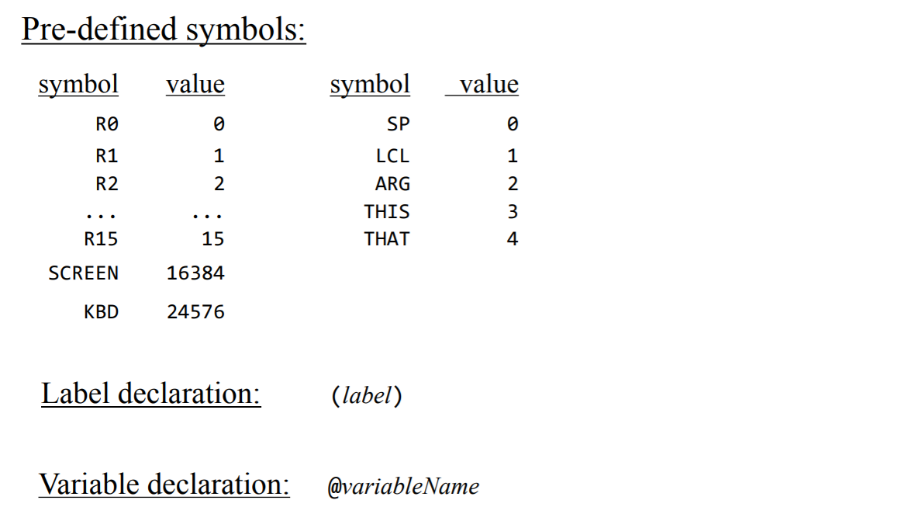
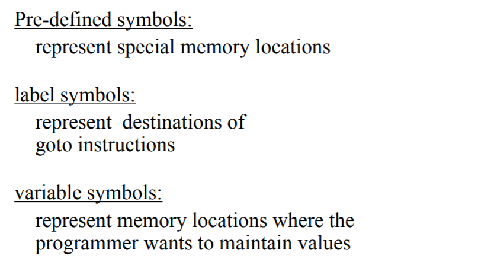
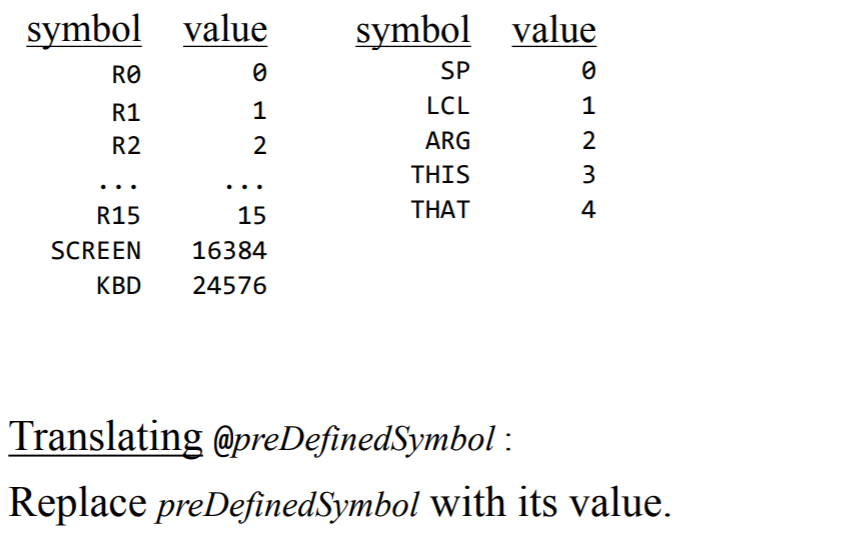
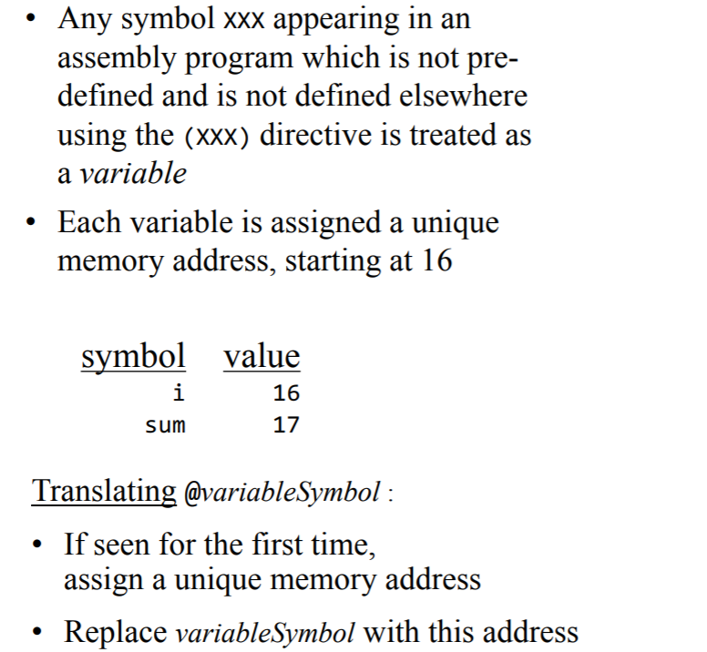
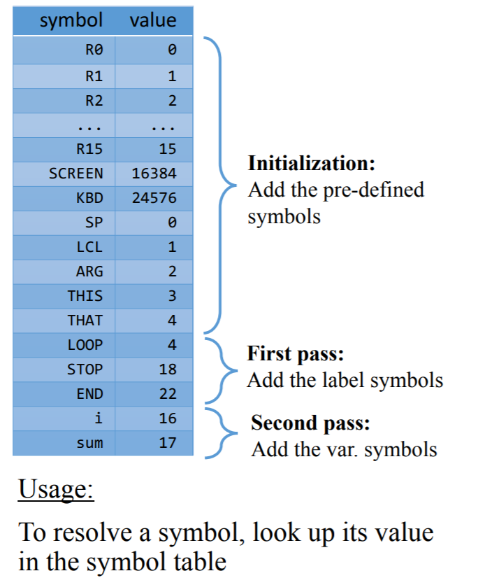
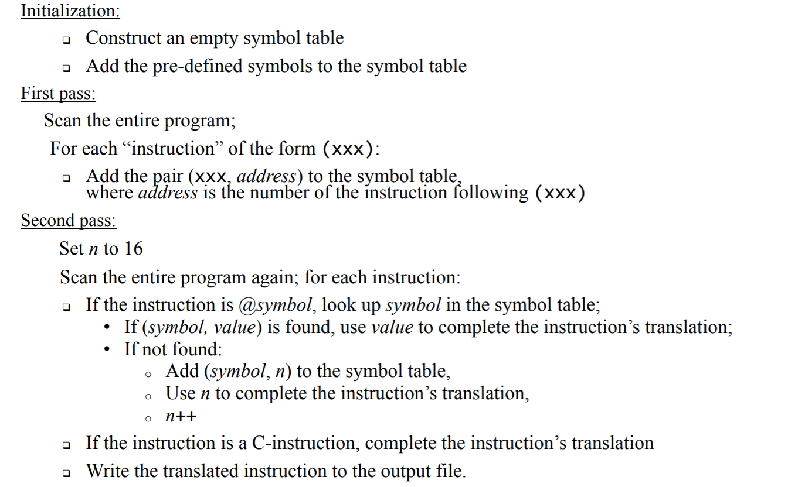

# Assembler

- Assumption: the assembly code is error-free.

## Hack Language Specifications

### A-instructions

### C-instructions

### Symbols

#### Pre-defined Symbols

#### Label Symbols

#### Variable Symbols

#### Symbol Table

## Assembly Process
