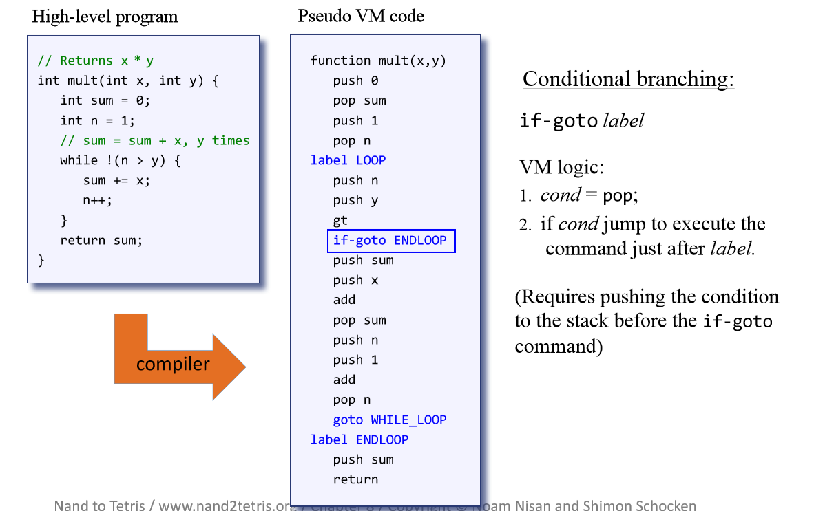
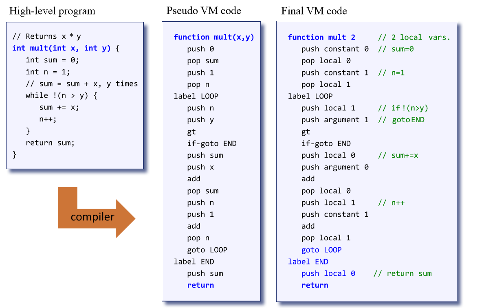
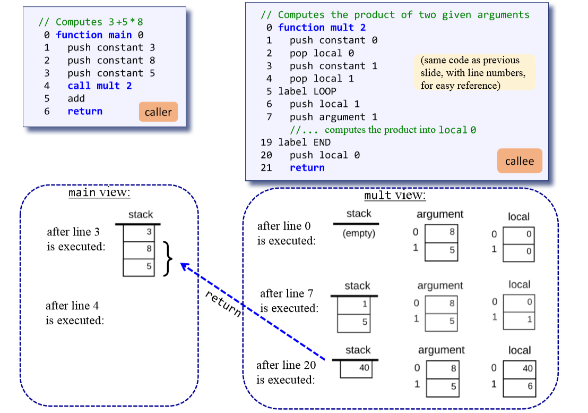
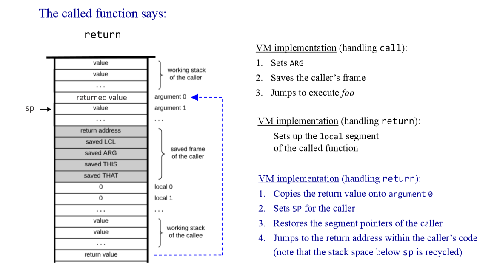

# Virtual Machine, Part II

## Branching

- goto label // jump to execute the command just after label
- if-goto label // cond= pop; // if cond jump to execute the command just after label
- label label // label declaration command

## Functions

Handling `call`:

- Determine the return address within the caller’s code;
- Save the caller’s return address, stack and memory segments;
- Pass parameters from the caller to the callee;
- Jump to execute the callee.

Handling `function`:

- Initialize the local variables of the callee;
- Handle some other simple initializations (later).

Handling `return`:

- (a function always ends by pushing a return value on the stack)
- Return the return valueto the caller;
- Recycle the memory resources used by the callee;
- Reinstate the caller’s stack and memory segments;
- Jump to the return address in the caller’s code.

